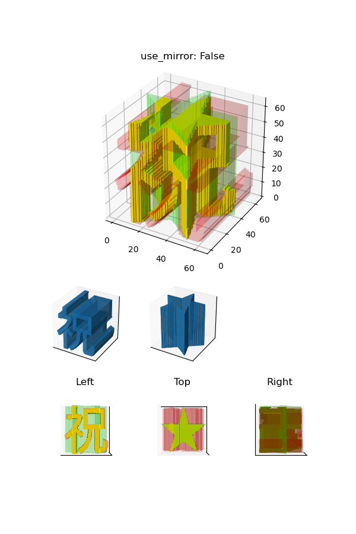

# illusional-dual-kanji


A program to create a mysterious object that changes its appearance in a mirror.

## Requirements

```shell
pip install -r requirements.txt
```

## Usage

```
usage: main.py [-h] [--resolution RESOLUTION] [--use_mirror] [--image_paths [IMAGE_PATHS ...]]
               [--chars [CHARS ...]] [--font_path FONT_PATH] [--render] [--color_coded]
               [--save_fig]
               object_name_or_path
```

-   `object_name_or_path`
    -   Requires the name of the object to be used as the name of the output files.
    -   If `object_name_or_path` ends with the extension `.stl`, this program will load the specified file instead of creating a new object.
-   To select two or three in total
    -   Image
        -   `--image_paths [IMAGE_PATHS ...]`
            -   You can specify multiple paths separated by spaces.
            -   Each path can be suffixed with a suffix for the instruction to be binarized:
                -   e.g. `@ge30`
                    -   After converting the image to grayscale, keep only those pixels that are greater than 30.
                -   e.g. `@le128`
                    -   After converting the image to grayscale, keep only those pixels that are less than 128.
    -   Character
        -   `--chars [CHARS ...]`
            -   You can specify multiple characters separated by spaces.
        -   `--font_path FONT_PATH`
-   Options
    -   `--resolution RESOLUTION`
    -   `--use_mirror`
        -   Reverse the top face.
-   To visialize (after saving the stl file)
    -   `--render`
        -   Render the generated object.
    -   `--color_coded`
        -   Separate the parts by color.
    -   `--save_fig`

## Gallery

### Two characters: 祝 and ★

```shell
python main.py celebration-star \
    --resolution 64 \
    --chars 祝 ★ \
    --font_path '/System/Library/Fonts/ヒラギノ角ゴシック W5.ttc' \
    --render \
    --save_fig
```

| w/o `--color_coded`                                      | w/ `--color_coded`                                             |
| -------------------------------------------------------- | -------------------------------------------------------------- |
|  |  |

### Three characters: N, L and P

```shell
python main.py NLP \
    --resolution 64 \
    --chars Ｎ Ｌ Ｐ \
    --font_path '/System/Library/Fonts/ヒラギノ角ゴシック W9.ttc' \
    --render \
    --save_fig
```

| w/o `--color_coded`                         | w/ `--color_coded`                                |
| ------------------------------------------- | ------------------------------------------------- |
|  |  |

### Two images: Pickaxe and Sword

These images are borrowed from https://minecraft.fandom.com/wiki.

```shell
python main.py pickaxe-sword \
    --resolution 64 \
    --use_mirror \
    --image_paths img/Diamond_Pickaxe_JE3_BE3.png@ge1 img/Diamond_Sword_JE3_BE3.png@ge1 \
    --render \
    --save_fig
```

| w/o `--color_coded`                                   | w/ `--color_coded`                                          |
| ----------------------------------------------------- | ----------------------------------------------------------- |
|  |  |
