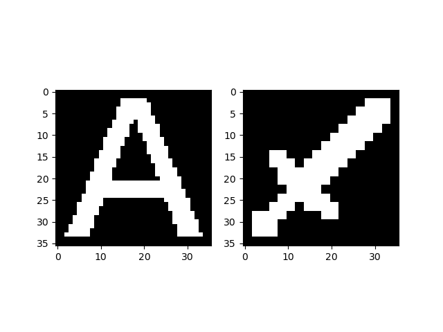

# Usage for Checking Operations

Here are two examples of how it works:

-   `MC`
    -   An example of using two images of a pickaxe and a sword.
    -   These images need to be borrowed from https://minecraft.fandom.com/wiki.
        -   "img/Diamond_Pickaxe_JE3_BE3.png" from https://minecraft.fandom.com/wiki/Pickaxe
        -   "img/Diamond_Sword_JE3_BE3.png" from https://minecraft.fandom.com/wiki/Sword
-   `NLP`
    -   An example of using the three letters N, L, and P.

## face.py

Helps to see how images and text will be displayed.

### Usage

```
usage: face.py [-h] [--resolution RESOLUTION]
               [--char CHAR] [--font_path FONT_PATH] [--char_inv]
               [--image_path IMAGE_PATH]
               [--save_fig OUTPUT_PATH]
```

Note that only one character and one image can be specified at a time.

### Example: Default parameters

```shell
# python src/face.py --char A --image_path img/Diamond_Sword_JE3_BE3.png@ge1
python src/face.py
```


### Example: Inverted version

```shell
python src/face.py --resolution 36 \
    --char A --char_inv \
    --image_path img/Diamond_Sword_JE3_BE3.png@le1@border2
```



## voxel.py

Helps to observe the generated object.

### Usage

```
usage: voxel.py [-h] [--resolution RESOLUTION]
                [--font_path FONT_PATH] [--char_inv]
                [--color_coded] [--save_fig OUTPUT_PATH]
                {MC,NLP}
```

If `--color_coded` is specified, the color will be changed for each part.

### Example: MC

```shell
python src/voxel.py MC
```


### Example: NLP

```shell
python src/voxel.py NLP --color_coded
```


## mesh.py

Saves and renders the generated object.

### Usage

```
usage: mesh.py [-h] [--resolution RESOLUTION]
               [--font_path FONT_PATH] [--char_inv]
               [--color_coded] [--save_fig OUTPUT_PATH]
               {MC,NLP}
```

If `--color_coded` is not specified, it will save the object as a stl file.
If specified, it will render the object in different colors depending on the axis.

### Example: MC

```shell
python src/mesh.py MC --color_coded
```


### Example: NLP

```shell
python src/mesh.py NLP --color_coded
```


