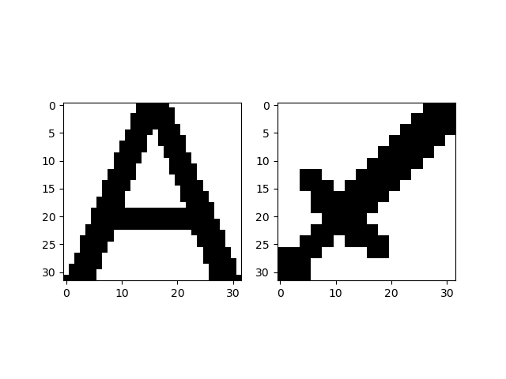
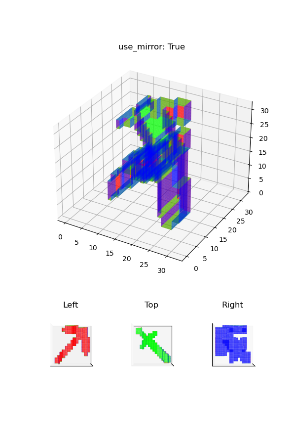

# Usage for Checking Operations

Here are two examples of how it works:

-   `MC`
    -   This is an example of using two images of a pickaxe and a sword.
    -   These images need to be borrowed from https://minecraft.fandom.com/wiki.
        -   "img/Diamond_Pickaxe_JE3_BE3.png" from https://minecraft.fandom.com/wiki/Pickaxe
        -   "img/Diamond_Sword_JE3_BE3.png" from https://minecraft.fandom.com/wiki/Sword
-   `NLP`
    -   This is an example of using the three letters N, L, and P.

## face.py

It is useful to see how images and text will be displayed.

### Usage

```shell
python src/face.py
```



## voxel.py

It helps to observe the generated object.

### Usage

```
usage: voxel.py [-h] [--resolution RESOLUTION] [--font_path FONT_PATH] [--color_coded] {MC,NLP}
```

### Example: MC

```shell
python src/voxel.py MC
```


### Example: NLP

Change colors for each part.

```shell
python src/voxel.py NLP --color_coded
```


## mesh.py

Saves and renders the generated object.

### Usage

```
usage: mesh.py [-h] [--resolution RESOLUTION] [--font_path FONT_PATH] [--color_coded] {MC,NLP}
```

If `-color_coded` option is not specified, the object will be saved, and if it is specified, it will be rendered.
The difference between mesh.py and voxel.py is that mesh.py changes colors depending on the direction.

### Example: MC

```shell
python src/mesh.py MC --color_coded
```



### Example: NLP

```shell
python src/mesh.py NLP --color_coded
```


